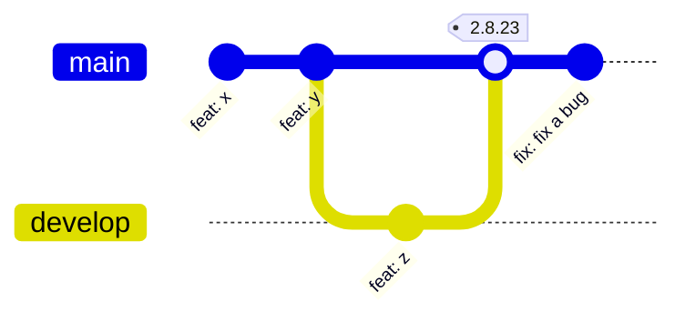
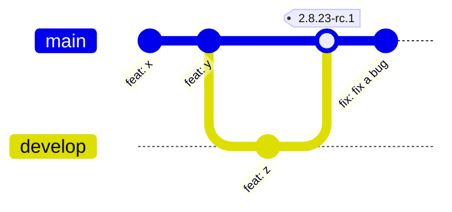

# AutoSemver

Using [Conventional Commits](https://www.conventionalcommits.org/) is a clean and uniform way to write commit messages that convey the purpose of the changes made in your codebase. This also enables you to automatically generate a changelog based on the commit messages.
This project provides a simple tool to automate [Semantic Versioning](https://semver.org/) based on the commit messages in your Git repository.

## Installation

```bash
go install github.com/StevenCyb/autosemver
```

## Usage

```
Usage: autosemver {version|help|[repository_path]} [options]

Commands:
        [repository_path]: path to the git repository (default: current directory)
        version: show the version of autosemver
        help: show this help message

Options:
        --help, -h: show this help message
        --verbose, -v: enable verbose output
        --release-candidate, -r: mark the version as a release candidate (append '-rc.N' to the version)
        --ignore-invalid-tag, -i: ignore invalid tags (not a valid semantic version)
        --disable-exit-1: do not exit with a non-zero code on error
        --mapping=feat:minor, -m=fix:patch: add mapping for commit types (prefix) to version increments {major, minor, patch}

Default Mapping (ignores not matching commits):
        "breaking change": major
        "fix!": major
        "feat!": major
        "feat": minor
        "pref": patch
        "fix": patch
```

## Explanation

### New Version

* Command: `autosemver .`
* Resulting Version: `2.8.24`
* Explanation: The last commit on the main branch is a `fix`, which increments the patch.


### New RC

* Command: `autosemver . --release-candidate`
* Resulting Version: `2.8.23-rc.2`
* Explanation: The last commit on the main branch is a `fix`, which normally increments the path. Since we want a RC, the last RC is incremented by 1.
